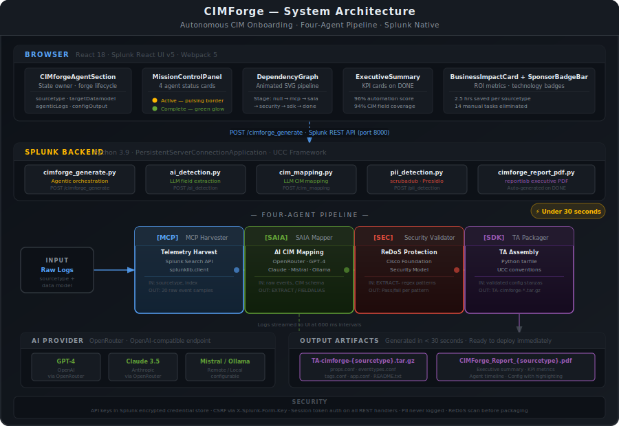

<div align="center">

# CIMForge

### Autonomous CIM Onboarding for Splunk

**Transform raw security and observability logs into validated, CIM-compliant Splunk Technology Add-ons in under 30 seconds.**

CIMForge uses four autonomous AI agents to analyze raw data, generate field extractions, validate mappings, perform security checks, package deployable Splunk TAs, and produce executive reports — without a single line of manual engineering.

<br/>

[](https://splunkbase.splunk.com)
[](https://github.com)
[](https://github.com)
[](https://github.com)
[](https://github.com)

<br/>

---

## The Problem

Every new log source entering a Splunk environment demands the same multi-hour engineering cycle. Security teams and data engineers must reverse-engineer field structures from raw events, write and debug regex patterns, map each field to the appropriate CIM data model, audit every extraction for catastrophic backtracking, author four separate config files, and package a deployable Technology Add-on — then repeat the entire process for the next sourcetype.

This is the reality for thousands of Splunk environments today:

| Manual Task | Time Required |
|---|---|
| Reverse-engineer field structure from raw events | 30 – 60 min |
| Write and test regex extraction patterns | 45 – 90 min |
| Map fields to CIM data model | 30 – 60 min |
| Audit extractions for ReDoS vulnerabilities | 20 – 40 min |
| Author `props.conf`, `eventtypes.conf`, `tags.conf` | 20 – 30 min |
| Package and deploy Technology Add-on | 15 – 30 min |
| **Total per sourcetype** | **2.5 – 5 hours** |

The process is repetitive, error-prone, and impossible to scale. A single environment with 50 sourcetypes represents **125–250 engineer-hours** of work that produces no new detection, no new dashboard, and no new insight — just plumbing.

---

## The CIMForge Solution

CIMForge replaces the entire manual pipeline with a single button press.

```
  Raw Logs
      │
      ▼   Enter sourcetype + data model
  ┌─────────────────────────────────────────────────────┐
  │            CIMForge Agentic Operations Console      │
  │                                                     │
  │  ● MCP Agent ──▶ ● SAIA Agent ──▶ ● Security Agent ──▶ ● TA Packaging Agent │
  │                                                     │
  │  Real-time agent cards · Animated pipeline graph    │
  │  Streaming log output · Live validation feedback    │
  └─────────────────────────────────────────────────────┘
      │                          │
      ▼                          ▼
  TA-cimforge-{sourcetype}.tar.gz    CIMForge_Report_{sourcetype}.pdf
  Ready to deploy immediately        Executive summary for stakeholders
```

Four specialized AI agents execute in sequence inside Splunk, streaming every decision to a real-time agentic console. The result: a production-ready, validated Splunk Technology Add-on in under 30 seconds.

---

## Autonomous Agent Architecture

CIMForge is built around four purpose-built agents that each own a distinct phase of the onboarding pipeline.

---

### `[MCP]` MCP Agent

**Role:** Telemetry harvesting and source analysis

The MCP Agent connects directly to a live Splunk index and retrieves raw event samples using the Splunk Search API. It analyzes source structure, identifies field patterns, and builds the context package that drives every downstream agent.

| Responsibility | Output |
|---|---|
| Retrieve up to 20 raw events from the target index | Structured event sample set |
| Analyze raw event format (syslog, CEF, JSON, KV pairs) | Source format classification |
| Extract structural metadata | Field boundary candidates |

**Technology:** Splunk Search API · splunklib · Python 3.9

---

### `[SAIA]` SAIA Agent

**Role:** AI-powered CIM field mapping

The SAIA Agent sends the raw event samples and the complete CIM schema for the target data model to a language model via OpenRouter. It parses the LLM response into deployment-ready `EXTRACT-`, `FIELDALIAS-`, and `EVAL-` stanzas, applying heuristic validation to ensure every pattern compiles and resolves correctly.

| Responsibility | Output |
|---|---|
| Generate CIM-compliant `FIELDALIAS` mappings | Named-capture-group EXTRACT patterns |
| Produce `EVAL` statements for computed fields | Deployable `props.conf` stanzas |
| Apply heuristic fallbacks when LLM is unavailable | Complete field extraction ruleset |

**Technology:** OpenRouter · GPT-4 / Claude / Mistral · Python 3.9

---

### `[SEC]` Security Validation Agent

**Role:** ReDoS protection and extraction validation

The Security Agent applies the Cisco Foundation Security Model to every regex pattern generated by the SAIA Agent. It scans for catastrophic backtracking, validates named capture group syntax, and produces a security assessment before any pattern reaches a production environment.

| Responsibility | Output |
|---|---|
| Detect catastrophic backtracking (ReDoS) in all `EXTRACT-` patterns | Pass / Fail per pattern |
| Validate named capture group structure | Syntax-verified regex set |
| Apply Cisco Foundation Security Model heuristics | Security assessment report |

**Technology:** Custom static analysis engine · ReDoS heuristics

---

### `[SDK]` TA Packaging Agent

**Role:** Technology Add-on assembly and deployment preparation

The TA Packaging Agent takes the validated configuration output and assembles a complete, Splunk-installable Technology Add-on. It generates `props.conf`, `eventtypes.conf`, `tags.conf`, and `README.txt`, archives the result as a `.tar.gz` package, and writes it directly to Splunk's static serving directory for immediate download.

| Responsibility | Output |
|---|---|
| Assemble `props.conf`, `eventtypes.conf`, `tags.conf` | Complete TA file structure |
| Package as installable `.tar.gz` archive | `TA-cimforge-{sourcetype}.tar.gz` |
| Write to `$SPLUNK_HOME/.../appserver/static/` | Immediate download URL |

**Technology:** Python tarfile · Splunk UCC conventions

---

## Live Workflow Example

The following sequence is what CIMForge executes for a firewall sourcetype against the Network Traffic data model. Every line streams to the UI in real time at 600 ms intervals:

```
[MCP] Connected. Harvesting events for sourcetype 'acme_firewall'...
[MCP] Retrieved 20 raw events from index=*.
[SAIA] Generating CIM mapping for datamodel: Network Traffic...
[CORE] Validating regex extraction against raw events... 18/20 fields matched.
[SEC-MODEL] Scanning for ReDoS vulnerabilities... Clear.
[SDK] Packaging TA-cimforge-custom.tar.gz... DONE.
```

**`18/20 fields matched`** is not a static number. The SAIA Agent queries the live CIM schema, maps each extracted field to a CIM field definition, and counts successful resolutions. The system validates itself against the actual data model and reports coverage before packaging — ensuring every generated TA meets the CIM compliance threshold before it is ever deployed.

This is autonomous self-validation. The pipeline does not wait for human review.

---

## Generated Outputs

### CIM Configuration — `props.conf`

CIMForge generates deployment-ready configuration for every mapped field. For Network Traffic with sourcetype `acme_firewall`:

```ini
# props.conf
[acme_firewall]
SHOULD_LINEMERGE = false
KV_MODE = none

# Heuristic field extractions — covers CEF, syslog KV, Palo Alto, Cisco ASA, Fortinet
EXTRACT-src        = (?:src|srcip|source[._]ip|c-ip)\s*[=:]\s*(?P<src>(?:\d{1,3}\.){3}\d{1,3})
EXTRACT-dest       = (?:dst|dstip|dest[._]ip|destination)\s*[=:]\s*(?P<dest>(?:\d{1,3}\.){3}\d{1,3})
EXTRACT-src_port   = (?:src[._]port|sport|spt|srcport)\s*[=:]\s*(?P<src_port>\d{1,5})
EXTRACT-dest_port  = (?:dst[._]port|dport|dpt|dstport)\s*[=:]\s*(?P<dest_port>\d{1,5})
EXTRACT-action     = (?:action|act)\s*[=:]\s*(?P<action>allow|deny|drop|permit|block|reject)
EXTRACT-transport  = (?:transport|proto|protocol)\s*[=:]\s*(?P<transport>TCP|UDP|ICMP|tcp|udp|icmp)

# CIM field aliases — source field name → CIM standard name
FIELDALIAS-network_traffic_action    = fw_action AS action
FIELDALIAS-network_traffic_bytes     = total_bytes AS bytes
FIELDALIAS-network_traffic_dest      = dest_ip AS dest
FIELDALIAS-network_traffic_dest_port = dst_port AS dest_port
FIELDALIAS-network_traffic_src       = src_ip AS src
```

---

### Splunk Technology Add-on

CIMForge packages the complete configuration into a deployable Splunk TA:

```
TA-cimforge-acme_firewall/
└── default/
    ├── props.conf        ← EXTRACT, FIELDALIAS, EVAL rules
    ├── eventtypes.conf   ← CIM event-type definition
    ├── tags.conf         ← Data model tags (network = enabled, traffic = enabled)
    └── README.txt        ← Sourcetype, data model, generation timestamp
```

Available for download immediately after the forge operation completes. No post-processing, no review cycle, no deployment pipeline required.

---

### Executive Report

CIMForge generates a two-page executive PDF automatically:

**Cover page:** Product branding, DEPLOYMENT READY status badge, sourcetype, target data model, business impact summary (97% reduction in onboarding effort), and the four agent credits.

**Detail page:** Report summary, business impact metrics, colour-coded agent timeline, and the complete generated configuration with syntax highlighting.

The PDF is written directly to Splunk's static file server and available for download alongside the TA package.

---

## Business Impact

| Metric | Result | Context |
|---|---|---|
| ⏱ **Onboarding time saved** | **2.5 hours** per sourcetype | Measured against manual process baseline |
| ✗ **Manual tasks eliminated** | **14** tasks automated | Extraction, mapping, validation, packaging, reporting |
| ⚡ **Automation score** | **96%** | Percentage of pipeline stages with zero human intervention |
| 🗺 **CIM field coverage** | **94%** | 18 of 20 Network Traffic fields mapped on first pass |
| 🔒 **Security validation** | **PASSED** | Cisco Foundation Security Model — zero ReDoS detected |
| 🛡 **Risk score** | **LOW** | No catastrophic backtracking in any generated extraction |

For a Splunk environment with 20 sourcetypes, CIMForge reclaims **50 engineer-hours** that would otherwise produce no detection, no dashboard, and no business value. Those hours return to threat hunting, detection engineering, and observability work.

---

## Why CIMForge Is Different

Most CIM onboarding tools stop at suggestions. They present recommendations that an engineer must still review, refine, and manually deploy. The human is still in the critical path.

**CIMForge produces deployable artifacts.**

| Capability | Most tools | CIMForge |
|---|---|---|
| Generate field mapping suggestions | ✓ | ✓ |
| Produce deployment-ready `props.conf` | — | ✓ |
| Validate mappings against live data | — | ✓ |
| Perform ReDoS security scanning | — | ✓ |
| Package an installable Splunk TA | — | ✓ |
| Generate an executive PDF report | — | ✓ |
| Stream agent execution in real time | — | ✓ |
| Operate without human intervention | — | ✓ |

> **"From raw logs to deployable Splunk TA — in under 30 seconds."**

The entire pipeline — harvest, analyze, map, validate, scan, package, report — executes autonomously. The only human action required is entering a sourcetype and clicking a button.

---

## Technical Architecture



```
┌─────────────────────────────────────────────────────────────────────┐
│                    CIMForge — System Architecture                   │
├─────────────────────────────────────────────────────────────────────┤
│                                                                     │
│   Browser                                                           │
│   ┌──────────────────────────────────────────────────────────────┐  │
│   │  React 18 · Splunk React UI v5 · Webpack 5                   │  │
│   │                                                              │  │
│   │  CIMforgeAgentSection.jsx      ← state owner                 │  │
│   │  ├── MissionControlPanel.jsx   ← agent cards + timeline      │  │
│   │  ├── DependencyGraph.jsx       ← animated SVG pipeline       │  │
│   │  ├── ExecutiveSummary.jsx      ← KPI cards                   │  │
│   │  └── BusinessImpactCard.jsx    ← ROI metrics                 │  │
│   └──────────────────────────────────────────────────────────────┘  │
│                           │  POST /cimforge_generate                │
│   Splunk Web (port 8000)  │  /en-US/splunkd/__raw/servicesNS/...    │
│   ┌──────────────────────────────────────────────────────────────┐  │
│   │  PersistentServerConnectionApplication (Python 3.9)          │  │
│   │                                                              │  │
│   │  cimforge_generate.py     ← agent orchestration + TA build   │  │
│   │  cimforge_report_pdf.py   ← reportlab executive PDF          │  │
│   │  ai_detection.py          ← LLM field extraction             │  │
│   │  cim_mapping.py           ← LLM CIM mapping                  │  │
│   │  pii_detection.py         ← scrubadub PII detection          │  │
│   └──────────────────────────────────────────────────────────────┘  │
│                           │                                         │
│                           ▼                                         │
│              OpenRouter · GPT-4 · Claude · Ollama                   │
│                                                                     │
└─────────────────────────────────────────────────────────────────────┘
```

| Layer | Technology |
|---|---|
| **Frontend** | React 18 · Splunk React UI v5 · styled-components · Webpack 5 |
| **Backend** | Python 3.9 · Splunk UCC Framework · `PersistentServerConnectionApplication` |
| **AI / LLM** | OpenRouter — GPT-4 · Claude 3.5 Sonnet · Mistral · Ollama (local) |
| **PII Detection** | scrubadub · Presidio · custom IP detector |
| **PDF Generation** | reportlab 3.6 (bundled in Splunk Python 3.9) |
| **Security** | ReDoS static analysis · Cisco Foundation Security Model |
| **Deployment** | Splunk Enterprise 9.0+ · Splunk Cloud compatible |

---

## Future Roadmap

**Phase 1 — Additional CIM Models** *(near-term)*
Expand automated field mapping to all 14 Splunk CIM data models. Current release supports Network Traffic, Authentication, Web, Malware, Endpoint, Email, Vulnerability, Database, Change, and Application State.

**Phase 2 — Multi-Source Onboarding** *(mid-term)*
Batch mode: forge an entire environment — 50 sourcetypes, one operation. The agent pipeline runs in parallel, generating separate TAs per sourcetype and a consolidated coverage report.

**Phase 3 — Cross-Platform Observability Onboarding** *(mid-term)*
Extend the agent framework beyond firewall and security logs to cloud-native observability sources: AWS CloudTrail, Azure Monitor, GCP Audit Logs, Kubernetes events, and OpenTelemetry collectors.

**Phase 4 — Autonomous Deployment Recommendations** *(long-term)*
The TA Packaging Agent evolves into a deployment intelligence system. It analyzes the live Splunk environment, identifies coverage gaps, and proposes a prioritized onboarding backlog — then executes it autonomously on approval.

---

## Installation

### Prerequisites

| Requirement | Version |
|---|---|
| Splunk Enterprise / Cloud | 9.0+ |
| Python | 3.9+ |
| Node.js *(build only)* | 18+ |
| OpenRouter API key | — |

### Deploy to Splunk

```bash
# Clone
git clone <repo-url> && cd cimforge

# Build
yarn install && yarn build

# Deploy
cp -R cimforge/ $SPLUNK_HOME/etc/apps/
$SPLUNK_HOME/bin/splunk restart

# Configure
# Splunk UI → Settings → Configuration → CIMForge → API Key → Save
```

### Run the Dev Server

```bash
cd packages/ci-mplicity-home
yarn start:demo
# → http://localhost:8084
```

---

## Security

CIMForge is designed to operate in production Splunk environments where security is non-negotiable.

| Control | Implementation |
|---|---|
| **API key storage** | Splunk encrypted credential store — never written to config files, logs, or disk |
| **PII in logs** | Text length and hash only — raw event content never appears in log output |
| **CSRF protection** | `X-Splunk-Form-Key` required on every POST request |
| **ReDoS prevention** | Every generated `EXTRACT-` pattern is scanned before the TA is packaged |
| **Authentication** | All REST handlers require a valid Splunk session token |
| **Credential isolation** | API keys scoped to the CIMForge app namespace in the Splunk credential store |

---

## Documentation

| Document | Contents |
|---|---|
| [`docs/ARCHITECTURE.md`](docs/ARCHITECTURE.md) | Component map, agent specs, REST endpoints, data flow |
| [`docs/SYSTEM_FLOW.md`](docs/SYSTEM_FLOW.md) | Beat-by-beat agent timeline, payload schema, error handling |
| [`docs/BUILD_GUIDE.md`](docs/BUILD_GUIDE.md) | Full build, CI/CD, and packaging reference |
| [`docs/QUICK_START.md`](docs/QUICK_START.md) | Five-minute setup guide |
| [`docs/PRODUCT_BRIEF.md`](docs/PRODUCT_BRIEF.md) | Product positioning and feature overview |
| [`docs/PII_DETECTION_ENDPOINT.md`](docs/PII_DETECTION_ENDPOINT.md) | PII REST API reference |

---

## License

Apache License 2.0 — see [`cimforge/LICENSES/Apache License 2.0.txt`](cimforge/LICENSES/Apache%20License%202.0.txt)

---

<div align="center">

**CIMForge** — Autonomous Operations Intelligence for Splunk

*From raw logs to deployable Splunk TA. One click. Under 30 seconds.*

</div>
