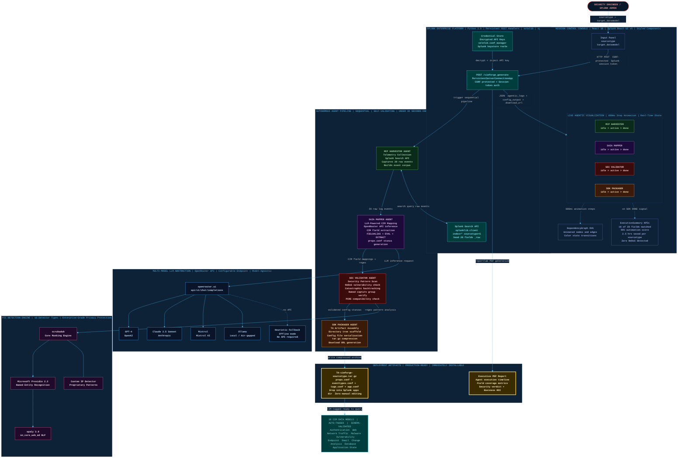

# CIMForge — System Architecture

> **Autonomous AI pipeline: raw security logs → validated, deployable Splunk Technology Add-on in under 30 seconds. No human review cycle. Zero manual editing.**

---

## Architecture Overview

---

## Component Legend

| Color | Layer | Components |
|---|---|---|
| 🟥 Red border | Entry point | Security Engineer |
| 🟦 Indigo | UI / Console | Mission Control React app, Input Panel, DependencyGraph, ExecutiveSummary |
| 🩵 Cyan | Splunk Platform | REST handler, Credential Store, Search API |
| 🟩 Green | MCP Agent | Telemetry harvester, event corpus builder |
| 🟣 Purple | SAIA Agent | LLM mapper, CIM field extractor, props.conf generator |
| 🔴 Red | SEC Agent | ReDoS scanner, pattern validator, PCRE checker |
| 🟠 Orange | SDK Agent | TA packager, tar.gz builder, URL generator |
| 🔵 Blue | LLM Abstraction | OpenRouter, GPT-4, Claude 3.5, Mistral, Ollama, Heuristic fallback |
| 🩷 Pink | PII Engine | scrubadub, Presidio 2.2, spaCy, Custom IP detector |
| 🟡 Gold | Artifacts | TA `.tar.gz` package, Executive PDF report |
| 🩵 Cyan | CIM Models | 10 supported data models, auto-tagged, schema-validated |

---

## Key Data Flows

| Flow | Description |
|---|---|
| **Input → REST** | HTTP POST with CSRF token + Splunk session auth |
| **Credential injection** | API key decrypted from Splunk keystore at runtime, never logged |
| **MCP ↔ Search API** | Bidirectional: query sent → raw events returned |
| **SAIA → OpenRouter** | Event corpus + CIM schema sent to LLM; returns structured mappings |
| **SEC → PII Engine** | All generated regex patterns routed through privacy/security scan |
| **SDK → TA Package** | Validated configs assembled into installable `.tar.gz` in one pass |
| **REST → UI** | Full `agentic_logs[]`, `config_output`, and `download_url` returned as JSON |
| **UI animation** | 600ms step timer reveals agent logs sequentially; status cards update state |

---

## Innovation Highlights

- **Autonomous end-to-end**: zero human review required between raw logs and deployable TA
- **Self-validating pipeline**: ReDoS scanning and field coverage validation built into the pipeline itself
- **Model-agnostic LLM**: swap GPT-4 / Claude / Mistral / local Ollama without code changes
- **Real-time mission control**: animated agent status visible to operator during the 30-second run
- **Production artifact output**: `.tar.gz` drop-in install, not a suggestion or a report
- **Heuristic fallback**: system degrades gracefully with no LLM API — pattern library still operates
- **Privacy-first**: PII scrubbed from event samples before any LLM call via Presidio + scrubadub

---

*Source: [`architecture_diagram.mmd`](architecture_diagram.mmd) — render locally with `npx @mermaid-js/mermaid-cli -i architecture_diagram.mmd -o architecture_diagram.png --theme dark --backgroundColor "#0a1929" --width 2400`*
