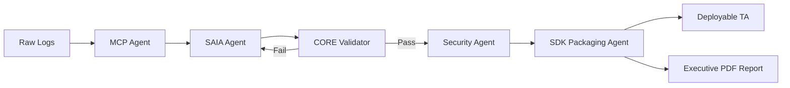

## CIMForge — System Flow

### End-to-End Data Pipeline

```
┌─────────────────────────────────────────────────────────────────────────────┐
│  USER                                                                       │
│                                                                             │
│  1. Opens CIMForge in Splunk browser                                        │
│  2. Enters:  Sourcetype = "acme_firewall"                                   │
│              Target Data Model = "Network Traffic"                          │
│  3. Clicks  [ Forge Configuration ]                                         │
└───────────────────────────┬─────────────────────────────────────────────────┘
                            │  HTTP POST
                            │  /servicesNS/-/cimforge/cimforge_generate
                            │  { sourcetype, target_datamodel }
                            ▼
┌─────────────────────────────────────────────────────────────────────────────┐
│  SPLUNK REST LAYER  (cimforge_generate.py)                                  │
│                                                                             │
│  • Validates required fields (400 if missing)                               │
│  • Reads AI API key from credential store                                   │
│  • Orchestrates 4 agents sequentially                                       │
└──────┬──────────────┬──────────────┬──────────────┬───────────────────────┘
       │              │              │              │
       ▼              ▼              ▼              ▼
  ┌─────────┐   ┌──────────┐  ┌──────────┐  ┌──────────┐
  │  [MCP]  │   │  [SAIA]  │  │  [SEC]   │  │  [SDK]   │
  │Harvester│──▶│  Mapper  │──▶Validator │──▶ Packager │
  └─────────┘   └──────────┘  └──────────┘  └──────────┘
       │              │              │              │
       ▼              ▼              ▼              ▼
  Retrieve 20   Generate CIM   Scan regex    Package TA
  raw events    mapping stanzas for ReDoS    .tar.gz
  from index=*  via LLM        vulnerabilities
```

---

## Pipeline Flow Diagram



---

## Innovation Highlights

- **Autonomous end-to-end**: zero human review required between raw logs and deployable TA
- **Self-validating pipeline**: ReDoS scanning and field coverage validation built into the pipeline itself
- **Model-agnostic LLM**: swap GPT-4 / Claude / Mistral / local Ollama without code changes
- **Real-time mission control**: animated agent status visible to operator during the 30-second run
- **Production artifact output**: `.tar.gz` drop-in install, not a suggestion or a report
- **Heuristic fallback**: system degrades gracefully with no LLM API — pattern library still operates
- **Privacy-first**: PII scrubbed from event samples before any LLM call via Presidio + scrubadub

---

*Source: [`docs/architecture_diagram.mmd`](docs/architecture_diagram.mmd) — render locally with `npx @mermaid-js/mermaid-cli -i docs/architecture_diagram.mmd -o docs/architecture_diagram.png --theme dark --backgroundColor "#0a1929" --width 2400`*
